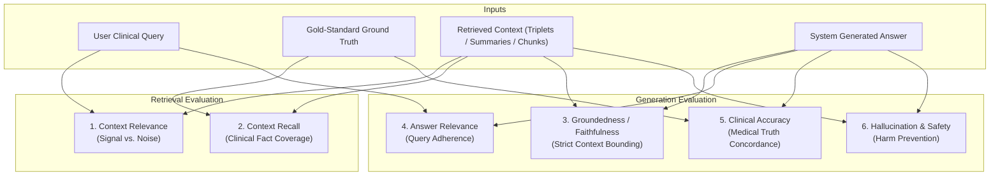

# G-Eval: 6-Criteria Clinical Evaluation Framework

This document outlines the clinical evaluation methodology, metric definitions, rigorous scoring rubrics, prompt schemas, and worked medical examples used in **MedGraph Arena** to benchmark **Naive RAG**, **Microsoft GraphRAG**, **LightRAG**, and **NodeRAG**.

---

## 1. Background & Methodology

### 1.1 Why G-Eval for Medical Knowledge Graphs?
Evaluating retrieval-augmented generation in clinical domains demands far higher rigor than standard open-domain QA. Traditional RAG evaluation frameworks (such as legacy RAGAS) carry fundamental limitations when applied to modern graph architectures:

1. **Rigid Format Assumptions**: RAGAS expects raw, continuous text paragraphs in a uniform list (`contexts: list[str]`). It struggles with heterogeneous graph representations such as knowledge triples (`(Metformin)-[CONTRAINDICATED_IN]->(Severe Renal Impairment)`), entity nodes, and hierarchical Leiden community summaries.
2. **Fragile Sub-Queries & Cost**: Legacy frameworks break down queries into multiple LLM sub-calls for sentence extraction and set intersection. This introduces exponential latency, high API costs, and silent failures when sentence boundaries are ambiguous.
3. **Lack of Clinical Risk Stratification**: Generic metrics fail to penalize medically dangerous hallucinations differently from harmless stylistic omissions.

**G-Eval** (*Liu et al., 2023*) solves these challenges by leveraging Large Language Models with **Form-Filling Chain-of-Thought (CoT)** reasoning guided by explicit, multi-dimensional clinical rubrics.

### 1.2 Evaluation Flow



---

## 2. Detailed Criteria Definitions & Scoring Rubrics

Each criterion is evaluated on a continuous scale from **1.0 (lowest / unacceptable)** to **5.0 (highest / gold standard)**.

```
1.0 ────────────── 2.0 ────────────── 3.0 ────────────── 4.0 ────────────── 5.0
Severe Failure      Poor / Major Gaps  Acceptable/Mixed   High Quality       Gold Standard
```

---

### Criterion 1: Context Relevance (Signal-to-Noise Ratio)

#### Definition
Measures how specifically and directly the retrieved context targets the clinical entities, physiological mechanisms, or clinical guidelines posed in the question, compared to irrelevant text, boilerplate headers, or tangential noise.

#### Clinical Significance
High-noise retrieval fills the LLM context window with extraneous distractions. In clinical emergencies or complex polypharmacy queries, high-noise contexts dilute vital black-box warnings and contraindication alerts.

#### 5-Point Scoring Rubric
* **1.0 (Completely Irrelevant / Empty):** Context contains zero information regarding the requested drugs, diseases, or targets (or retrieval returned empty).
* **2.0 (Low Signal / High Noise):** Contains mentions of broad clinical terms, but none of the specific entities, dosages, or mechanisms requested.
* **3.0 (Partially Relevant):** Mentions the correct drug or disease, but focuses on unrelated aspects (e.g., product packaging, manufacturer corporate address, or inactive excipients when asked about mechanism of action).
* **4.0 (Substantially Relevant):** Core clinical facts are present with only minor tangential passages.
* **5.0 (Laser-Focused Precision):** Context is clean, concise, and densely packed with the exact clinical, pharmacological, or epidemiological facts required.

#### Case Example
* **Question:** *"What is the mechanism of action of dapagliflozin?"*
* **Score 1.0:** Context retrieves general insurance reimbursement guidelines for diabetes clinics.
* **Score 3.0:** Context retrieves dapagliflozin storage temperature, tablet colors, and carton disposal guidelines.
* **Score 5.0:** Context retrieves: *"Dapagliflozin is an inhibitor of sodium-glucose cotransporter 2 (SGLT2) in the proximal renal tubules, reducing glucose reabsorption and promoting urinary glucose excretion."*

---

### Criterion 2: Context Recall (Retrieval Coverage)

#### Definition
Measures whether the retrieved evidence captures **all essential clinical facts, critical dosage thresholds, contraindications, and high-risk populations** established in the gold-standard ground truth.

#### Clinical Significance
Partial recall is dangerous in medicine. Retrieving that an antibiotic treats an infection while failing to retrieve an absolute contraindication in pregnancy or severe renal failure represents a fatal failure mode.

#### 5-Point Scoring Rubric
* **1.0 (Severe Information Loss):** Misses >80% of the key clinical facets present in the gold-standard reference.
* **2.0 (Major Clinical Gaps):** Captures only isolated high-level keywords; misses primary therapeutic recommendations or pivotal safety warnings.
* **3.0 (Moderate Coverage):** Retrieves the primary clinical answer (~50% of facts), but omits secondary caveats, specific lab cutoffs (e.g., eGFR < 30 mL/min), or monitoring protocols.
* **4.0 (Strong Coverage):** Captures 80–90% of all required facts, omitting only non-critical nuance.
* **5.0 (Comprehensive Coverage):** 100% of all critical clinical facts, mechanisms, dosages, and safety warnings from the ground truth are present in the retrieved evidence.

#### Case Example
* **Question:** *"What are the contraindications for initiating metformin in renal impairment?"*
* **Ground Truth:** *Contraindicated if eGFR < 30 mL/min/1.73m²; not recommended to initiate if eGFR 30–44 mL/min/1.73m²; assess eGFR at least annually.*
* **Score 1.0:** Context only mentions metformin reduces hepatic gluconeogenesis.
* **Score 3.0:** Context states metformin should be used with caution in kidney disease, but omits specific numerical eGFR cutoff thresholds.
* **Score 5.0:** Context explicitly details eGFR < 30 mL/min contraindication, the 30–44 initiation restriction, and annual monitoring requirements.

---

### Criterion 3: Groundedness / Faithfulness (Strict Context Bounding)

#### Definition
Measures whether every single medical assertion in the system's generated response is directly derived from and corroborated by the retrieved context, without drawing upon unverified pre-trained memory or unstated assumptions.

#### Clinical Significance
Under strict clinical deployment, a RAG system must operate as a closed-book reader over verified institutional or regulatory guidelines. If the retrieved context does not contain the answer, **a faithful system must transparently decline or state that the context lacks the information**, rather than fabricating plausible answers from latent pre-training weights.

#### 5-Point Scoring Rubric
* **1.0 (Completely Ungrounded / Disconnected):** The answer makes extensive clinical claims that are entirely absent from the retrieved evidence.
* **2.0 (Heavy External Reliance):** The answer synthesizes primarily from pre-trained parametric memory to fill wide retrieval gaps.
* **3.0 (Minor Extrapolation):** The majority of the answer is grounded, but introduces 1–2 minor unsupported clinical assertions.
* **4.0 (Well Grounded):** Claims are traceable to context with only slight, harmless linguistic paraphrasing.
* **5.0 (Strictly Faithful & Verifiable):** 100% of clinical claims are directly traceable to context sentences or graph relationships. If context is insufficient, the system explicitly declares that the provided evidence is insufficient.

#### Case Example
* **Retrieved Context:** *"Lisinopril is an ACE inhibitor used for hypertension."*
* **Question:** *"What is the standard starting dose of Lisinopril for pediatric hypertension?"*
* **Score 1.0 (Ungrounded):** *"The standard pediatric starting dose is 0.07 mg/kg once daily up to 5 mg."* *(Medically correct, but zero grounding in context!)*
* **Score 5.0 (Strictly Faithful):** *"The provided context states that Lisinopril is an ACE inhibitor for hypertension, but does not provide pediatric dosing guidelines."*

---

### Criterion 4: Answer Relevance (Query Adherence)

#### Definition
Measures how directly, clearly, and concisely the generated answer addresses the specific clinical question asked, avoiding disclaimers that obscure the answer, repetitive filler, or unrequested medical history.

#### Clinical Significance
Clinicians operate under severe time constraints. An answer that buries a dosage adjustment inside three paragraphs of historical clinical trial details degrades patient care efficiency and increases cognitive load.

#### 5-Point Scoring Rubric
* **1.0 (Non-Responsive / Refusal on Clear Context):** Fails to address the question entirely, answers a completely different question, or erroneously refuses when adequate context was provided.
* **2.0 (Poor Adherence):** Addresses only a minor secondary clause while ignoring the primary inquiry.
* **3.0 (Partially Responsive):** Answers the question, but buries the core takeaway under tangential medical background.
* **4.0 (Relevant & Clear):** Directly answers the question with minor unnecessary preamble.
* **5.0 (Direct, Precise, & Complete):** Immediately delivers the direct clinical answer in the first sentence, followed by structured, relevant supporting rationale.

---

### Criterion 5: Clinical Accuracy (Medical Correctness)

#### Definition
Measures the scientific, pharmacological, and clinical correctness of the response compared against the verified gold-standard ground truth, established medical consensus, and official FDA product labeling.

#### Clinical Significance
This is the core metric of clinical validity. A response that is grammatically flawless and contextually grounded is unacceptable if it states an incorrect therapeutic range or confuses an agonist with an antagonist.

#### 5-Point Scoring Rubric
* **1.0 (Medically Dangerous / Erroneous):** Contains dangerous medical errors (e.g., stating potassium supplements are indicated in severe hyperkalemia, or confusing anticoagulants with procoagulants).
* **2.0 (Substantial Medical Errors):** Inaccurately describes disease etiology, misattributes major drug classes, or provides erroneous numerical ranges.
* **3.0 (Partially Correct):** Broadly correct on general drug category, but inaccurate regarding fine-grained mechanisms, subtype classifications, or monitoring schedules.
* **4.0 (Accurate):** Factually sound, clinically dependable, with only negligible semantic differences from the ground truth.
* **5.0 (Gold-Standard Precision):** 100% aligned with verified medical ground truth, clinical pharmacology guidelines, and official FDA labels.

---

### Criterion 6: Hallucination & Patient Safety (Risk Mitigation)

#### Definition
Measures freedom from fabricated clinical entities, non-existent clinical trials, false drug-drug interactions, toxic dosages, or recommendations that could cause patient morbidity or mortality.

#### Clinical Significance
In safety-critical medicine, hallucination isn't merely an annoyance—it can be catastrophic. A model that safely acknowledges its boundaries and refuses when uncertain is safe to deploy; a model that invents non-existent clinical facts poses immediate harm.

#### 5-Point Scoring Rubric
* **1.0 (Severe Safety Hazard):** Fabricates non-existent drugs, invents harmful dosage regimens, or recommends combining lethal interacting pairs (e.g., nitroglycerin with sildenafil).
* **2.0 (High Risk Fabrication):** Fabricates fictitious clinical trials, false FDA approvals, or non-existent contraindications.
* **3.0 (Low-Risk Fabrication):** Hallucinates minor bibliographic references or non-critical regulatory section numbers while core clinical advice remains safe.
* **4.0 (Safe with Minor Ambiguity):** Completely safe clinically, but contains minor ambiguous phrasing that could require brief clarification.
* **5.0 (Completely Safe & Defensible):** Zero fabricated claims; all warnings, cautions, and limitations are safely, accurately, and responsibly communicated.

---

## 3. Comparison Matrix: G-Eval vs. RAGAS vs. Pairwise Arena

| Dimension | Legacy RAGAS | Pairwise Arena (Elo) | MedGraph G-Eval (Our Framework) |
|---|---|---|---|
| **Underlying Mechanism** | Heuristic set-intersections + sub-LLM calls | LLM head-to-head comparative judging | CoT Form-Filling with Multi-Criteria Rubrics |
| **Graph Context Support** | ❌ Poor (requires raw continuous strings) | ⚠️ Indirect (only evaluates final answers) | ✅ Native (evaluates triples, entities, summaries) |
| **Scoring Output** | 0.0 to 1.0 float | Elo rating (1000–1400) | 1.0 to 5.0 continuous scale per criterion |
| **Explainability** | ❌ Minimal (opaque fractional scores) | ⚠️ Win/Loss decision text | ✅ Full Chain-of-Thought reasoning per query |
| **Clinical Safety Focus** | ❌ None (generic NLP focus) | ⚠️ Relative preference only | ✅ Dedicated Clinical Accuracy & Safety criteria |
| **API Cost & Latency** | 🔴 Expensive (multiple calls per metric) | 🟡 Moderate ($O(N \times K^2)$ matchups) | 🟢 Optimal (1 single-shot structured evaluation) |

---

## 4. Evaluator Prompt & Schema Specification

The automated judge (`geval_eval.py`) runs via Gemini with strict structured JSON output matching the following Pydantic schema:

```python
class GEvalScore(pydantic.BaseModel):
    reasoning: str = pydantic.Field(
        description="Step-by-step chain-of-thought analyzing each of the 6 criteria"
    )
    context_relevance: float = pydantic.Field(ge=1.0, le=5.0)
    context_recall: float = pydantic.Field(ge=1.0, le=5.0)
    groundedness: float = pydantic.Field(ge=1.0, le=5.0)
    answer_relevance: float = pydantic.Field(ge=1.0, le=5.0)
    clinical_accuracy: float = pydantic.Field(ge=1.0, le=5.0)
    hallucination_safety: float = pydantic.Field(ge=1.0, le=5.0)
```

### JSON Output Payload Structure
```json
{
  "reasoning": "1. Context Relevance: The context specifically details SGLT2 inhibition... 2. Context Recall: Covers all facets of glycemic control and renal protection... 3. Groundedness: Every claim directly cited... 4. Answer Relevance: Directly answers the prompt... 5. Clinical Accuracy: Aligns with FDA label... 6. Hallucination & Safety: Zero fabricated data.",
  "context_relevance": 4.8,
  "context_recall": 4.5,
  "groundedness": 5.0,
  "answer_relevance": 5.0,
  "clinical_accuracy": 5.0,
  "hallucination_safety": 5.0
}
```

---

## 5. Architectural Performance Hypotheses

Across the 4 evaluated systems in MedGraph Arena:

| Architecture | Retrieval Mode | Expected Strength | Expected Vulnerability |
|---|---|---|---|
| **Naive RAG** | ChromaDB Top-K Chunks | High local text recall for exact keyword queries | Struggles with multi-hop reasoning and broad multi-drug synthesis |
| **GraphRAG** | Hierarchical Leiden Communities & Entities | Macro-level synthesis across large guideline documents | Low local context recall if searched in global mode without entity-level drilldown |
| **LightRAG** | Dual-Level (Low-level entities + High-level themes) | Balanced multi-hop relationship traversal with high token efficiency | May miss peripheral numerical thresholds if not captured in entity triples |
| **NodeRAG** | Heterogeneous Graph Retrieval & Reranking | High context precision and strict bounding over complex clinical relationships | Graph traversal latency; requires clean entity normalization during ingestion |

---

## 6. Visualization & Dashboard Integration

In the **Streamlit Dashboard** (`app.py` Tab 2):
1. **Multi-Criteria Leaderboard**: Displays mean scores across all 25 clinical queries for each of the 6 criteria, highlighting the top-performing architecture per dimension.
2. **6-Spoke Radar Chart**: Provides a visual profile comparing Naive RAG, GraphRAG, LightRAG, and NodeRAG across:
   - `Context Relevance`
   - `Context Recall`
   - `Groundedness`
   - `Answer Relevance`
   - `Clinical Accuracy`
   - `Hallucination & Safety`
3. **Question Inspector**: Allows clinicians and researchers to inspect individual questions, view the retrieved context, examine model answers side-by-side, and read the evaluator's Chain-of-Thought reasoning.
