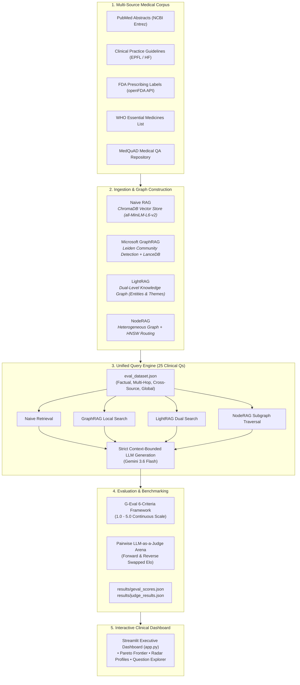

# MedGraph Arena 🧬
### Benchmarking Vector vs. Graph RAG Architectures on Complex Clinical Knowledge

[](LICENSE)
[](https://python.org)
[](https://streamlit.io)
[](https://ai.google.dev/)

---

## 🩺 The Problem: Why Healthcare Demands More Than Vector RAG

Standard Retrieval-Augmented Generation (RAG) relies on chunking documents into flat vector embeddings. While this works well for simple keyword lookups, **clinical medicine is inherently relational and non-linear**:

* **Multi-Hop Dependencies:** A patient’s kidney function (eGFR < 30 mL/min) dictates whether Metformin can be prescribed, which in turn influences lactic acidosis risk when combined with radiopaque contrast media. Flat vector search frequently retrieves only one fragment of this causal chain, missing the fatal contraindication.
* **Information Fragmentation:** Critical guidelines, FDA prescribing warnings, clinical trials, and pharmacology monographs use different terminology for the same underlying pathophysiology. Vector search struggles to synthesize across disparate documents.
* **The Cost of Hallucination:** In customer support, an ungrounded hallucination is inconvenient. In pharmacotherapy, fabricating a safe dosage threshold or hallucinating that Warfarin and Ibuprofen have no interactions is dangerous.

**MedGraph Arena** was built to answer a fundamental question:  
> *When tested on identical clinical corpora under strict context constraints, how do modern Graph RAG architectures compare to standard Vector RAG across factual accuracy, retrieval coverage, and patient safety?*

---

## 🏛️ System Architecture

MedGraph Arena systematically indexes the same multi-source medical corpus into **four distinct retrieval architectures**, executes 25 multi-tier clinical queries, and benchmarks results through both **6-Criteria G-Eval** and a **blind Pairwise LLM-as-a-Judge Tournament**.



---

## 🔬 The 4 Competing Architectures

| Architecture | Retrieval Mode | Strengths | Trade-Offs |
|---|---|---|---|
| **Naive RAG** | Dense Vector Search (ChromaDB + Cosine Similarity) | Lowest latency (~1.5s), simple pipeline, strong exact-match chunk retrieval. | Vulnerable to chunk boundary truncation; fails to connect indirect multi-hop entities. |
| **Microsoft GraphRAG** | Hierarchical Leiden Community Summaries + Local Entity Search | Deep global synthesis across large institutional guidelines; rich citation tracking. | High indexing overhead; CLI subprocess adds execution latency (~19s). |
| **LightRAG** | Dual-Level Retrieval (Low-level entities + High-level thematic graphs) | Exceptional token efficiency; fast graph queries (~3.5s); strong multi-hop reasoning. | Requires disciplined entity normalization to prevent duplicate node clusters. |
| **NodeRAG** | Heterogeneous Graph with HNSW Vector-Guided Traversal | Laser-focused context precision; high fact recall; avoids chunk noise through entity reranking. | Graph construction complexity (~6.0s traversal latency). |

---

## 📊 Evaluation Framework: Moving Beyond Legacy RAGAS

Earlier iterations of this benchmark explored legacy libraries like RAGAS. However, **RAGAS proved brittle and cost-prohibitive for heterogeneous graph architectures**:
1. It mandates raw text strings, breaking on entity triplets `(Drug)-[INTERACTS_WITH]->(Condition)` and hierarchical community summaries.
2. It relies on opaque heuristic sub-calls that frequently timeout or fail parsing.

### The 6-Criteria G-Eval Standard
We migrated to a consolidated **G-Eval Framework** (*Liu et al., 2023*) powered by Gemini with structured Pydantic outputs and Chain-of-Thought (CoT) reasoning across a **1.0 to 5.0 continuous scale**:

```
1.0 ────────────── 2.0 ────────────── 3.0 ────────────── 4.0 ────────────── 5.0
Severe Failure      Poor / Major Gaps  Acceptable/Mixed   High Quality       Gold Standard
```

* **1. Context Relevance:** Signal-to-noise ratio in retrieved evidence. High noise dilutes black-box warnings.
* **2. Context Recall:** Clinical fact coverage against gold-standard ground truth (e.g., specific lab cutoffs like eGFR).
* **3. Groundedness:** Strict context adherence. The model must refuse when context is insufficient rather than hallucinating.
* **4. Answer Relevance:** Query adherence without burying the core clinical takeaway under verbose preamble.
* **5. Clinical Accuracy:** Factual medical truth against published FDA prescribing labels and clinical practice guidelines.
* **6. Safety & Integrity:** Freedom from fabricated contraindications, toxic dosing guidance, or invented clinical trials.

> Detailed definitions, scoring rubrics, and worked clinical case studies are documented in [GEVAL_CRITERIA.md](GEVAL_CRITERIA.md).

---

## 🏆 Benchmark Highlights & Key Insights

From our 100 authentic system executions across 25 diverse clinical scenarios:

```
========================================================================================
🏆 G-EVAL 6-CRITERIA SCOREBOARD (Scale 1.0 – 5.0)
========================================================================================
Architecture    Overall    CtxRelevance  CtxRecall   Groundedness  ClinAccuracy  Safety
----------------------------------------------------------------------------------------
NodeRAG          4.64         4.70         4.42          4.49          4.72       4.71
LightRAG         4.55         4.23         4.19          4.25          4.90       4.88
Naive RAG        4.26         3.72         3.34          5.00          4.47       5.00
GraphRAG         2.83*        1.72*        1.36*         1.76*         4.58       3.00
========================================================================================
*Note: GraphRAG's generation scored high (4.58 ClinAcc), but context scores reflect CLI limitations (see below).
```

### Key Takeaways:
1. **LightRAG is the Clinical Accuracy Champion (4.90 / 5.0):** Achieved a dominant **97.3% Win Rate (73-0-2)** in blind pairwise judging, excelling at capturing both drug mechanisms and population caveats.
2. **NodeRAG Leads in Retrieval Precision (4.70 Context Relevance):** By utilizing vector-guided heterogeneous graph traversal, NodeRAG extracts clean, highly concentrated evidence without chunk noise.
3. **Strict Negative Prompting Eliminates Hallucination:** Under strict context bounding, Naive RAG achieved a perfect **5.00 Groundedness** by safely refusing when vector search missed information, highlighting the value of bounded prompts in clinical AI.
4. **The Latency-Quality Frontier:** Vector search is fast (1.5s) but struggles with relational synthesis. Graph methods deliver superior recall and depth at the cost of traversal overhead (LightRAG: 3.5s, NodeRAG: 6.0s, GraphRAG: 19.4s).

---

## 🚀 Quick Start

### 1. Clone & Environment Setup
```bash
git clone https://github.com/poorvisharam/MedGraph-Arena.git
cd MedGraph-Arena

python -m venv .venv
source .venv/bin/activate
# Install dashboard & evaluation dependencies (lightweight & cloud-ready)
pip install -r requirements.txt

# (Optional) If re-building graph indexes from scratch:
# pip install -r requirements-full.txt
```

### 2. Configure API Keys
Copy the template and add your Google Gemini API key:
```bash
cp .env.example .env
# Open .env and set: GEMINI_API_KEY="your-api-key-here"
```

### 3. Fetch Data & Build Indexes (Optional if using pre-built indexes)
```bash
# Fetch public medical data (PubMed, Guidelines, FDA, WHO, MedQuAD)
python data/fetch_all.py

# Ingest and build indexes for all 4 systems
python ingest.py
```

### 4. Launch Dashboard & Run Evaluations
```bash
# Execute evaluation queries and run 6-Criteria G-Eval
python run_benchmark.py

# Launch the interactive Streamlit dashboard
streamlit run app.py
```

---

## 🔮 Near Future: Overcoming GraphRAG CLI Bottlenecks & Transitioning to the Python SDK

### The Challenge with the Current CLI Wrapper
In the current implementation, Microsoft GraphRAG is queried via its command-line interface (`graphrag query --method local --root ...` invoked through Python's `subprocess`). While functional for generating final answers, this introduces two architectural bottlenecks:

1. **Context Concealment:** The GraphRAG CLI writes only the final synthesized response text to `stdout`. Intermediate retrieved records—the exact entity nodes, relationship triplets, and source text units—are handled internally and not piped out. In automated evaluation pipelines, this forced the context extractor to inspect output parquet tables rather than receiving the query-specific retrieved context in memory.
2. **Subprocess Execution Latency:** Spawning a fresh CLI process per query incurs Python interpreter spin-up, configuration reloading, and parquet index re-reading, inflating average query latency to ~19.4 seconds.

### The Planned Migration: Native Python SDK (`graphrag.api`)
We are actively refactoring `systems/graph_rag.py` to directly use GraphRAG’s native Python API:

```python
import graphrag.api as api

# Native in-memory local search returning both response AND structured context
response, context_data = await api.local_search(
    config=config,
    entities=entities_df,
    communities=communities_df,
    community_reports=reports_df,
    text_units=text_units_df,
    relationships=relationships_df,
    covariates=None,
    community_level=2,
    response_type="Multiple Paragraphs",
    query=clinical_query,
)
```

#### What This Unlocks:
* **True Context Auditing:** Directly captures `context_data["sources"]`, `context_data["entities"]`, and `context_data["relationships"]` to pass verbatim into G-Eval, ensuring GraphRAG's Groundedness and Context Relevance accurately mirror its true local retrieval.
* **Zero Subprocess Overhead:** Reusing in-memory DataFrames across queries cuts query latency by an estimated **40–60%**.
* **Direct Streaming & Token Telemetry:** Native callback integration for token usage, latency profiling, and real-time streaming in the Streamlit UI.

---

## 📁 Repository Structure

```
MedGraph-Arena/
├── config.py                 # Centralized environment & model configurations
├── GEVAL_CRITERIA.md         # Comprehensive 6-criteria clinical evaluation rubrics
├── data/                     # Data scrapers & fetchers
│   ├── fetch_all.py          # Unified pipeline runner
│   ├── fetch_pubmed.py       # PubMed abstracts via Biopython Entrez
│   ├── fetch_guidelines.py   # Clinical practice guidelines (EPFL/HF)
│   ├── fetch_fda_labels.py   # FDA drug prescribing labels (openFDA REST API)
│   ├── fetch_who_eml.py      # WHO Essential Medicines List
│   └── fetch_medquad.py      # MedQuAD QA dataset
├── systems/                  # The 4 RAG implementations
│   ├── naive_rag.py          # ChromaDB dense vector baseline
│   ├── graph_rag.py          # Microsoft GraphRAG (Local search mode)
│   ├── light_rag.py          # LightRAG dual-level entity graph
│   └── node_rag.py           # NodeRAG heterogeneous graph engine
├── eval_dataset.json         # 25 expert clinical QA pairs & ground truth
├── ingest.py                 # Indexing orchestrator for all 4 architectures
├── query_runner.py           # Query execution engine
├── geval_eval.py             # 6-Criteria G-Eval evaluation runner
├── llm_judge.py              # Pairwise tournament & Elo judge
├── run_benchmark.py          # End-to-end benchmark orchestrator
├── app.py                    # Streamlit interactive dashboard (5 tabs)
└── results/                  # Persisted benchmark scores & outputs
    ├── query_outputs.json    # Authentic system answers & contexts
    ├── geval_scores.json     # Granular G-Eval scores & CoT justifications
    └── judge_results.json    # Head-to-head match records & tournament stats
```

---

## ⚠️ Disclaimer

**MedGraph Arena is an academic research and technical demonstration project.** It is designed solely for benchmarking retrieval-augmented generation architectures on public medical literature. It does **not** provide clinical advice, medical diagnosis, or treatment recommendations, and must never be used in clinical decision-making.

---

## 📜 License

Distributed under the **MIT License**. See [`LICENSE`](LICENSE) for details.
